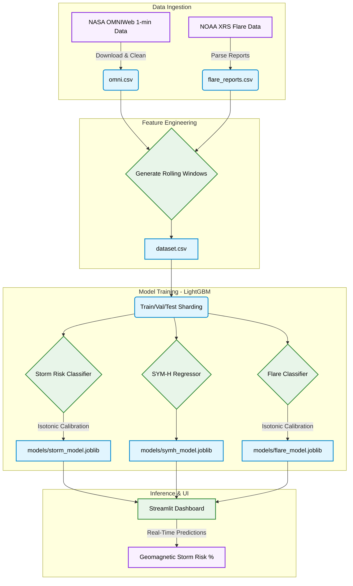

<div align="center">

# SolarWind-Forecaster

**A data science pipeline and LightGBM model suite for 15-minute forecasting of geomagnetic storm risk, SYM-H index prediction, and solar flare classification using NASA/NOAA datasets.**

[](https://www.python.org/)
[](https://lightgbm.readthedocs.io/)
[](https://streamlit.io/)
[](https://pandas.pydata.org/)

</div>

---

## Architecture Overview

Developed as a highly robust Data Science portfolio project, this repository implements a complete machine learning pipeline for predicting severe space weather events (geomagnetic storms). It processes decades of high-resolution solar wind data from NASA and NOAA, builds complex time-series features, trains LightGBM models for storm risk classification, SYM-H index regression, and solar flare prediction, and visualizes the results via an interactive Streamlit dashboard.

---

### Data Science Pipeline



## Features

| Stage | Description |
|---|---|
| **Data Ingestion** | Parses fixed-width NASA OMNIWeb 1-minute solar wind data and NOAA flare reports, handling sentinel missing values across 45+ columns. |
| **Feature Engineering** | Generates overlapping rolling windows (15-min, 60-min means/stds/min/max/deltas) across 20 solar wind parameters to give the models historical context. |
| **Model Training** | Trains three LightGBM models — a binary storm risk classifier, a SYM-H index regressor, and a solar flare classifier — using incremental shard-based training with Isotonic Regression calibration. |
| **Streamlit Dashboard** | Provides a modern, reactive interface to perform Exploratory Data Analysis (EDA) and run real-time inference with live storm risk predictions. |

---

## Technology Stack

| Component | Technologies |
|:---|:---|
| **Machine Learning** | `LightGBM`, `Scikit-learn` (Isotonic Regression), `Joblib` |
| **Data Engineering** | `Pandas`, `NumPy`, `PyArrow` (Parquet I/O), `SciPy` |
| **Visualizations** | `Matplotlib`, `Seaborn`, `Streamlit` |
| **Automation** | `GitHub Actions (CI/CD)`, `Makefile` |

---

## Project Structure

```
SolarWind-Forecaster/
│
├── configs/                    # Configuration files
├── models_deploy/              # Saved model artifacts and metadata
├── notebooks/                  # Jupyter notebooks for Exploratory Data Analysis and Model Evaluation
├── reports/                    # Generated reports
├── scripts/                   # Utility scripts
├── src/                        # Core Python ML Pipeline
│   ├── data_ingestion.py       # Fixed-width NASA OMNIWeb parser
│   ├── feature_engineering.py  # Rolling windows and temporal feature creation
│   ├── data_sharding.py        # Train/Val/Test Parquet splitting
│   ├── model_training.py       # LightGBM incremental shard-based training
│   ├── model_inference.py      # Real-time prediction wrappers
│   └── experiments/            # Experimental scripts (LSTMs, Drag models)
├── tests/                      # Unit tests
├── app.py                      # Streamlit interactive dashboard
├── Makefile                    # Automation shortcuts
└── README.md                   # You are here
```

---

## Setup & Execution

### Prerequisites

- Python 3.11+
- `make` utility (optional, for automation)

### 1. Clone the Repository

```bash
git clone https://github.com/aryan11singh/SolarWind-Forecaster.git
cd SolarWind-Forecaster
```

### 2. Install Dependencies

```bash
pip install -r requirements.txt
```

### 3. Run the Pipeline (via Makefile)

You can run the entire pipeline step-by-step using the provided `Makefile`.

```bash
# 1. Download and parse the raw data into processed CSVs
make data

# 2. Add time-series lags and rolling features
make features

# 3. Shard the data and train the models
make train
```

### 4. Launch the Dashboard

Once the data is generated and the models are trained, launch the Streamlit app to interact with the predictions.

```bash
make dashboard
```

The app will open automatically in your browser at `http://localhost:8501`.

---

## CI/CD Pipeline

This repository is equipped with a GitHub Actions workflow (`.github/workflows/ci.yml`). Every push to the `main` branch triggers:
1. **Formatting Checks**: Ensures compliance with `black` and `isort`.
2. **Linting**: Runs `flake8` to catch syntax errors and undefined variables.
3. **Unit Tests**: Executes the `pytest` suite inside the `tests/` directory.