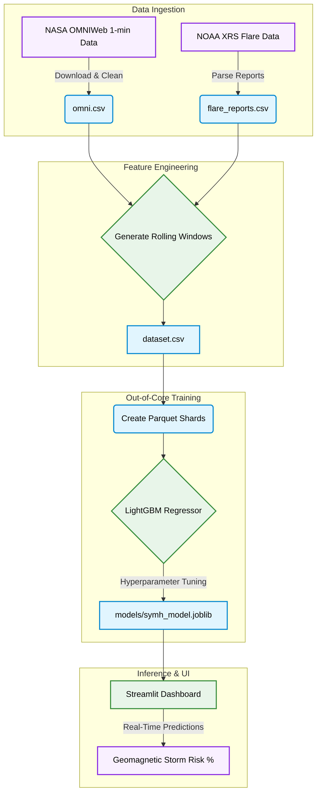

<div align="center">

#  SolarWind Forecaster

**A data science pipeline and LightGBM model for 15-minute forecasting of geomagnetic storm risk using massive NASA/NOAA datasets.**

[](https://www.python.org/)
[](https://lightgbm.readthedocs.io/)
[](https://streamlit.io/)
[](https://pandas.pydata.org/)

</div>

---

##  Overview

Developed as a highly robust Data Science portfolio project, this repository implements a complete machine learning pipeline for predicting severe space weather events (geomagnetic storms). It processes decades of high-resolution solar wind data from NASA and NOAA, builds complex time-series features, trains a LightGBM regressor using out-of-core techniques to handle memory constraints, and visualizes the results via an interactive Streamlit dashboard.

---

###  Data Science Pipeline



##  Features

| Stage | Description |
|---|---|
| **Data Ingestion** | Handles massive, highly-dimensional JSON and CSV dumps from standard government APIs (NASA/NOAA). |
| **Feature Engineering** | Generates overlapping rolling windows (e.g., 15-min, 60-min means/stds) to give the models historical context. |
| **Out-of-Core Training** | Solves memory limitation issues by sharding the 30-year dataset into smaller Parquet files and streaming them through LightGBM. |
| **Streamlit Dashboard** | Provides a modern, reactive interface to perform Exploratory Data Analysis (EDA) and run real-time inference. |

---

##  Tech Stack

**Machine Learning** - LightGBM · Scikit-Learn · Joblib
**Data Engineering** - Pandas · PyArrow (Parquet) · NumPy
**Visualizations** - Matplotlib · Seaborn · Streamlit
**Automation** - GitHub Actions (CI/CD) · Makefile

---

##  Directory Structure

```
Space-Weather-Sentinel/
│
├── notebooks/                  # Jupyter notebooks for Exploratory Data Analysis and Model Evaluation
├── data/                       # Ignored by git; raw API dumps, intermediate CSVs, and Parquet shards
├── models/                     # Saved LightGBM artifacts (.joblib)
├── src/                        # Core Python ML Pipeline
│   ├── data_ingestion.py       # Download and parse logic
│   ├── feature_engineering.py  # Rolling windows and temporal feature creation
│   ├── data_sharding.py        # Parquet shard creation
│   ├── model_training.py       # Out-of-core LightGBM training loop
│   ├── model_inference.py      # Real-time prediction wrappers
│   └── experiments/            # Experimental scripts (LSTMs, Drag models)
├── app.py                      # Streamlit interactive dashboard
├── Makefile                    # Automation shortcuts
└── README.md                   # You are here
```

---

##  Setup and Installation

### Prerequisites

- Python 3.11+
- `make` utility (optional, for automation)

### 1. Clone the Repository

```bash
git clone https://github.com/Shashank17singh/Space-Weather-Sentinel.git
cd Space-Weather-Sentinel
```

### 2. Install Dependencies

```bash
pip install -r requirements.txt
```

### 3. Run the Pipeline (via Makefile)

You can run the entire pipeline step-by-step using the provided `Makefile`.

```bash
# 1. Download and parse the raw data into processed CSVs
make data

# 2. Add time-series lags and rolling features
make features

# 3. Shard the data and train the LightGBM models
make train
```

### 4. Launch the Dashboard

Once the data is generated and the models are trained, launch the Streamlit app to interact with the predictions.

```bash
make dashboard
```

The app will open automatically in your browser at `http://localhost:8501`.

---

## CI/CD Pipeline

This repository is equipped with a GitHub Actions workflow (`.github/workflows/ci.yml`). Every push to the `main` branch triggers:
1. **Formatting Checks**: Ensures compliance with `black` and `isort`.
2. **Linting**: Runs `flake8` to catch syntax errors and undefined variables.
3. **Unit Tests**: Executes the `pytest` suite inside the `tests/` directory.
